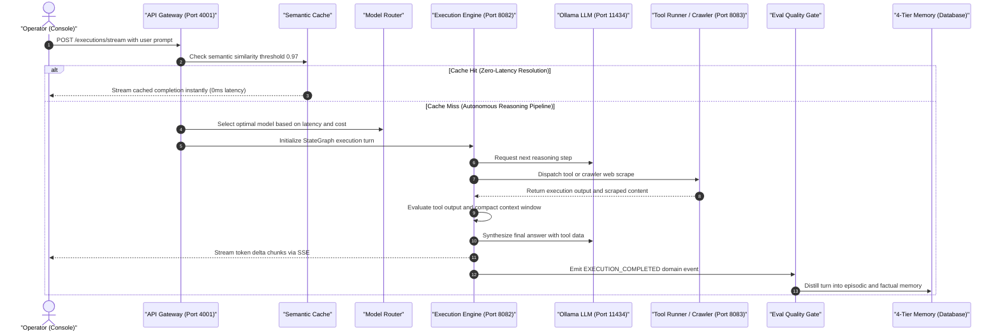

# OrchestrAI — System Flow & Architecture Guide

A definitive architectural blueprint and execution walkthrough for the OrchestrAI platform.

---

## 1. Monorepo Component Tree

```text
orchestrai/
├── apps/                                   # Deployable Applications & Services
│   ├── console/         (Port 3001)        │ Next.js 15 Operator Studio & Agent Cockpit
│   ├── gateway/         (Port 4001)        │ Primary Ingress API (REST, WebSocket, SSE)
│   ├── realtime/        (Port 4002)        │ SSE & WebSocket event streaming broker
│   ├── worker/          (Port 4003)        │ Background BullMQ task & queue processor
│   ├── admin/           (Port 4004)        │ Tenant administration & backoffice portal
│   ├── orchestrator/    (gRPC 50051)       │ StateGraph DAG orchestrator & checkpointer
│   ├── intelligence/    (Port 8082)        │ Python LangGraph reasoning & Conv-RAG sidecar
│   └── crawler/         (Port 8083)        │ Python Playwright web scraper & RAG ingestion
│
└── packages/                               # Modular Internal Domain Engines
    ├── core/                               │ Absolute source of truth (contracts, schemas)
    ├── regex/                              │ Centralized regular expressions & lexical patterns
    ├── shared-types/                       │ Canonical enums, event names, system scopes
    ├── database/                           │ PostgreSQL 16 Prisma ORM, migrations, pgvector
    ├── models/                             │ LLM adapters (Ollama, streaming, tokenizers)
    ├── tools/                              │ Sandboxed tool execution registry & path jails
    ├── agent/                              │ Agent loop, state machine, runner resolver
    ├── runtime/                            │ Directed StateGraph DAG execution & HITL
    ├── memory/                             │ 4-tier memory (episodic, fact, preference, task)
    ├── rag/                                │ Vector indexing, chunking, hybrid search
    ├── semantic-cache/                     │ Cosine similarity cache & instant SSE hits
    ├── model-router/                       │ Real-time empirical latency tracker & routing
    ├── eval/                               │ Quality gate, output completeness, error scoring
    ├── prompts/                            │ Canonical specialist personas & system prompts
    ├── billing/                            │ Token counting, budget gates, cost ledger
    ├── resilience/                         │ Circuit breakers, retries, timeouts, bulkheads
    ├── events/                             │ Domain event publisher & transactional outbox
    ├── queue/                              │ BullMQ producers, priority scheduling
    ├── grpc/                               │ Protobuf RPC contracts and gRPC clients
    ├── observability/                      │ OpenTelemetry traces, metrics, JSON logger
    └── sdk/                                │ External TypeScript SDK client library
```

---

## 2. End-to-End System Execution Flow

When a user submits a prompt in the **Console Studio**, the system executes across 10 coordinated stages:



---

## 3. Step-by-Step Stage Breakdown

### Stage 1: Ingress & Semantic Cache

- Request arrives at `apps/gateway` with tenant authentication.
- `packages/semantic-cache` computes prompt embedding vector. If cosine similarity with a previous query exceeds `0.97`, the cached result streams immediately to the user with **0 ms model cost**.

### Stage 2: Budget Gate & Model Routing

- `packages/billing` verifies tenant token limits and balance before LLM dispatch.
- `packages/model-router` selects the optimal model using live empirical latency quantiles.

### Stage 3: Conversational RAG & Memory Recall

- `packages/memory` performs 4-tier recall (`USER_PREFERENCE`, `FACT`, `EPISODIC`, `TASK`).
- `packages/rag` retrieves top-3 relevant knowledge base documents.
- `apps/intelligence` applies Conversational RAG, filtering history to only semantically relevant past turns.

### Stage 4: Resilient Reasoning & StateGraph

- `packages/runtime` (TypeScript) or `apps/intelligence` (Python LangGraph) initiates execution.
- LLM calls run inside a `packages/resilience` pipeline (circuit breaker, 2 retries, 120s deadline, bulkhead).
- Durable state snapshots persist to PostgreSQL checkpointer after every step.

### Stage 5: Sandboxed Tool Execution & Web Crawling

- High-risk actions trigger Human-in-the-Loop clearance (`APPROVAL_REQUESTED`).
- Safe tools execute inside `packages/tools` path jails.
- Web browsing and deep site crawling execute via `apps/crawler` Playwright headless browser.

### Stage 6: Telemetry & Memory Distillation

- Granular domain events emit via `packages/events` (`TOOL_CALLED`, `EXECUTION_COMPLETED`).
- `packages/eval` scores completeness, tool accuracy, and tokens/sec throughput.
- Distillation triggers automatically, storing episodic learnings into `packages/memory`.

---

## 4. How Python Services Connect

- **`apps/intelligence` (Port 8082)**: Accepts execution runs via HTTP `POST /execute` or selective context compression via `POST /context/selective`. When executing tools, it calls upstream `apps/gateway` at `/tools/execute`.
- **`apps/crawler` (Port 8083)**: Scrapes JavaScript-rendered sites via Playwright. When crawling with `ingest_to_rag: true`, it chunks markdown and uploads directly to `apps/gateway` at `/rag/documents`.
