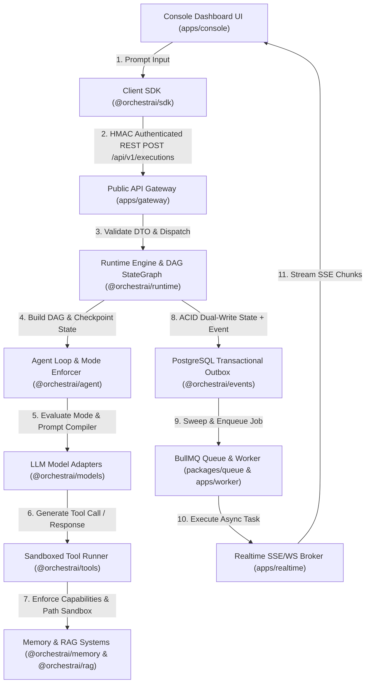

# OrchestrAI — End-to-End Master Usage & System Flow Guide

Welcome to **OrchestrAI**, a local-first, modular AI agent orchestration platform designed for enterprise reliability, strict domain boundary isolation, and Human-in-the-Loop (HITL) clearance safety.

---

## 1. Overview of Applications & Packages (Purposes)

### Applications (`apps/*`)

| Application                                                                                         |  Port  | Purpose & Primary Responsibility                                                                                                                                           |
| :-------------------------------------------------------------------------------------------------- | :----: | :------------------------------------------------------------------------------------------------------------------------------------------------------------------------- |
| **[`apps/gateway`](file:///Users/yuvarajpattabi/Yuva/yuva-devlab/Repos/orchestrai/apps/gateway)**   | `4001` | **Public API Gateway**: Central REST HTTP endpoint managing tenant authentication, rate limiting, request context, and routing requests to internal runtime services.      |
| **[`apps/realtime`](file:///Users/yuvarajpattabi/Yuva/yuva-devlab/Repos/orchestrai/apps/realtime)** | `4002` | **Realtime Streaming Broker**: Standalone WebSocket and Server-Sent Events (SSE) gateway multiplexing domain events and presence channels to frontend clients.             |
| **[`apps/worker`](file:///Users/yuvarajpattabi/Yuva/yuva-devlab/Repos/orchestrai/apps/worker)**     | `4003` | **Asynchronous Worker Application**: Background process running BullMQ processors, long-running agent DAG executions, document chunking, and DLQ maintenance.              |
| **[`apps/console`](file:///Users/yuvarajpattabi/Yuva/yuva-devlab/Repos/orchestrai/apps/console)**   | `3001` | **Universal Cowork Studio UI**: Modern Next.js 15 interface providing interactive prompt execution, threaded sessions, reasoning drawers, artifacts, and telemetry stream. |

---

### Workspace Packages (`packages/*`)

| Package                                                                                                                  | Purpose & Primary Responsibility                                                                                                                                                |
| :----------------------------------------------------------------------------------------------------------------------- | :------------------------------------------------------------------------------------------------------------------------------------------------------------------------------ |
| **[`@orchestrai/core`](file:///Users/yuvarajpattabi/Yuva/yuva-devlab/Repos/orchestrai/packages/core)**                   | **Absolute Source of Truth**: Houses all domain contracts, Zod schemas, branded UUID identifiers, and domain error hierarchies with zero workspace dependencies.                |
| **[`@orchestrai/database`](file:///Users/yuvarajpattabi/Yuva/yuva-devlab/Repos/orchestrai/packages/database)**           | **Prisma ORM & Connection Pool**: PostgreSQL 16 schema, migrations, connection pool, health diagnostics, and multi-tenant isolation.                                            |
| **[`@orchestrai/shared-types`](file:///Users/yuvarajpattabi/Yuva/yuva-devlab/Repos/orchestrai/packages/shared-types)**   | **Shared Enums & Constants**: Common enums (`AgentMode`, `ExecutionStatus`, `MessageRole`, `ModelProvider`, `ToolPermissionLevel`).                                             |
| **[`@orchestrai/models`](file:///Users/yuvarajpattabi/Yuva/yuva-devlab/Repos/orchestrai/packages/models)**               | **LLM Adapter Layer**: Unified `ILlmAdapter` interface connecting to Ollama, Groq, OpenRouter, Google AI Studio, OpenAI, and Anthropic.                                         |
| **[`@orchestrai/tools`](file:///Users/yuvarajpattabi/Yuva/yuva-devlab/Repos/orchestrai/packages/tools)**                 | **Security Perimeter & Tools**: Tool catalog (`read_file`, `write_file`, `bash`, `http_fetch`) with path jail sandboxing, SSRF allowlists, and permission clearance evaluators. |
| **[`@orchestrai/agent`](file:///Users/yuvarajpattabi/Yuva/yuva-devlab/Repos/orchestrai/packages/agent)**                 | **Agent Loop & Mode Enforcer**: State machine controller, multi-tier prompt compiler, mode constraint enforcer (`CHAT`, `PLAN`, `ACT`, `AUTO`), and specialized agents.         |
| **[`@orchestrai/runtime`](file:///Users/yuvarajpattabi/Yuva/yuva-devlab/Repos/orchestrai/packages/runtime)**             | **DAG Execution & StateGraph**: Directed state graph engine, durable checkpointer, rewind time-travel, crash recovery, and multi-agent router.                                  |
| **[`@orchestrai/memory`](file:///Users/yuvarajpattabi/Yuva/yuva-devlab/Repos/orchestrai/packages/memory)**               | **Controlled Memory System**: Categorical memory storage (`CONVERSATION`, `WORKING`, `EPISODIC`, `FACT`) with pgvector search, TTL retention, and privacy sanitization.         |
| **[`@orchestrai/rag`](file:///Users/yuvarajpattabi/Yuva/yuva-devlab/Repos/orchestrai/packages/rag)**                     | **RAG & Retrieval Pipeline**: Text extractors, sliding-window token chunkers, embedding providers, and hybrid retrieval.                                                        |
| **[`@orchestrai/events`](file:///Users/yuvarajpattabi/Yuva/yuva-devlab/Repos/orchestrai/packages/events)**               | **Outbox & Event Bus**: Asynchronous `MemoryEventBus`, Redis Streams engine, PostgreSQL Transactional Outbox poller, and Saga coordinator.                                      |
| **[`@orchestrai/queue`](file:///Users/yuvarajpattabi/Yuva/yuva-devlab/Repos/orchestrai/packages/queue)**                 | **Queue & BullMQ Producers**: Redis BullMQ producer abstractions with exponential backoff and backpressure watermarks.                                                          |
| **[`@orchestrai/sdk`](file:///Users/yuvarajpattabi/Yuva/yuva-devlab/Repos/orchestrai/packages/sdk)**                     | **Client SDK**: Developer SDK featuring cryptographically signed HMAC requests, automatic retries, and SSE stream iterators.                                                    |
| **[`@orchestrai/observability`](file:///Users/yuvarajpattabi/Yuva/yuva-devlab/Repos/orchestrai/packages/observability)** | **OpenTelemetry & Metrics**: W3C trace propagation, OpenTelemetry spans, and Prometheus metric text exposition.                                                                 |
| **[`@orchestrai/resilience`](file:///Users/yuvarajpattabi/Yuva/yuva-devlab/Repos/orchestrai/packages/resilience)**       | **Reliability & Fault Tolerance**: Composable resilience pipelines combining timeouts, exponential backoff, circuit breakers, and rate limiters.                                |
| **[`@orchestrai/grpc`](file:///Users/yuvarajpattabi/Yuva/yuva-devlab/Repos/orchestrai/packages/grpc)**                   | **gRPC Inter-Service Layer**: Protobuf RPC contracts and gRPC transport client for binary inter-service communications.                                                         |
| **[`@orchestrai/eval`](file:///Users/yuvarajpattabi/Yuva/yuva-devlab/Repos/orchestrai/packages/eval)**                   | **Evaluation Harness**: Benchmark dataset runner scoring tool selection accuracy, output matching, and latency quantiles.                                                       |

---

## 2. Step-by-Step File & Service Execution Flow Trace

When a user submits a prompt in the **Console Dashboard UI**, it travels through the system step-by-step:



### Detailed File Location Trace

#### Step 1: User Input Submission

- **File**: [`apps/console/src/features/console/console-page-content.tsx`](file:///Users/yuvarajpattabi/Yuva/yuva-devlab/Repos/orchestrai/apps/console/src/features/console/console-page-content.tsx)
- **Package / Service**: `apps/console`
- **What Happens**: `ConsolePageContent` captures user prompt input, mode selection (`CHAT`, `PLAN`, `ACT`, `AUTO`), and invokes `handleTriggerRun()`.

#### Step 2: Client SDK & Cryptographic HMAC Request Signing

- **File**: [`packages/sdk/src/resources/agents.ts`](file:///Users/yuvarajpattabi/Yuva/yuva-devlab/Repos/orchestrai/packages/sdk/src/resources/agents.ts) & [`packages/sdk/src/security/hmac-signer.ts`](file:///Users/yuvarajpattabi/Yuva/yuva-devlab/Repos/orchestrai/packages/sdk/src/security/hmac-signer.ts)
- **Package / Service**: `@orchestrai/sdk`
- **What Happens**: `client.agents.run()` constructs request payload, stamps UUIDv4 nonces, generates HMAC-SHA256 signature, and sends HTTP `POST /api/v1/executions` to Gateway.

#### Step 3: API Gateway & Security Policy Middleware

- **File**: [`apps/gateway/src/controllers/execution.controller.ts`](file:///Users/yuvarajpattabi/Yuva/yuva-devlab/Repos/orchestrai/apps/gateway/src/controllers/execution.controller.ts) & [`apps/gateway/src/middleware/auth.middleware.ts`](file:///Users/yuvarajpattabi/Yuva/yuva-devlab/Repos/orchestrai/apps/gateway/src/middleware/auth.middleware.ts)
- **Package / Service**: `apps/gateway`
- **What Happens**: Validates API Key (`x-api-key`), checks tenancy headers (`x-tenant-id`), enforces rate limits, validates `CreateExecutionDto`, and delegates run to `@orchestrai/runtime`.

#### Step 4: Runtime DAG Engine & State Checkpoint

- **File**: [`packages/runtime/src/engine/orchestrai-runtime.ts`](file:///Users/yuvarajpattabi/Yuva/yuva-devlab/Repos/orchestrai/packages/runtime/src/engine/orchestrai-runtime.ts) & [`packages/runtime/src/checkpoint/postgres-checkpointer.ts`](file:///Users/yuvarajpattabi/Yuva/yuva-devlab/Repos/orchestrai/packages/runtime/src/checkpoint/postgres-checkpointer.ts)
- **Package / Service**: `@orchestrai/runtime`
- **What Happens**: `AgentGraphBuilder` constructs a directed state graph DAG (`ModelNode` -> `ToolEvaluatorNode` -> `ToolExecutorNode` -> `ApprovalGateNode`) and saves a PostgreSQL checkpoint matching `(execution_id, step_index)`.

#### Step 5: Agent State Machine & Mode Enforcement

- **File**: [`packages/agent/src/loop/agent-loop.ts`](file:///Users/yuvarajpattabi/Yuva/yuva-devlab/Repos/orchestrai/packages/agent/src/loop/agent-loop.ts) & [`packages/agent/src/modes/enforcement/mode-constraint-enforcer.ts`](file:///Users/yuvarajpattabi/Yuva/yuva-devlab/Repos/orchestrai/packages/agent/src/modes/enforcement/mode-constraint-enforcer.ts)
- **Package / Service**: `@orchestrai/agent`
- **What Happens**: `mode-constraint-enforcer.ts` guarantees that LLM proposed actions strictly observe active mode strategy (`CHAT` blocking mutations, `PLAN` permitting read-only tools, `ACT` allowing authorized actions). `prompt-compiler.ts` compiles prompt instructions.

#### Step 6: Model Provider Routing & Usage Aggregation

- **File**: [`packages/models/src/adapters/factory.ts`](file:///Users/yuvarajpattabi/Yuva/yuva-devlab/Repos/orchestrai/packages/models/src/adapters/factory.ts) & [`packages/models/src/usage/usage-aggregator.ts`](file:///Users/yuvarajpattabi/Yuva/yuva-devlab/Repos/orchestrai/packages/models/src/usage/usage-aggregator.ts)
- **Package / Service**: `@orchestrai/models`
- **What Happens**: `createAdapter` dispatches prompt to Ollama, OpenAI, or Anthropic, tracking token consumption and cost pricing.

#### Step 7: Security Perimeter & Sandboxed Tool Execution

- **File**: [`packages/tools/src/executor/sandbox-executor.ts`](file:///Users/yuvarajpattabi/Yuva/yuva-devlab/Repos/orchestrai/packages/tools/src/executor/sandbox-executor.ts) & [`packages/tools/src/sandbox/path-jail.ts`](file:///Users/yuvarajpattabi/Yuva/yuva-devlab/Repos/orchestrai/packages/tools/src/sandbox/path-jail.ts)
- **Package / Service**: `@orchestrai/tools`
- **What Happens**: `path-jail.ts` enforces real-path symlink jail, `network-allowlist.ts` blocks private IP SSRF attacks. If classified `DANGEROUS`, execution halts, creating a Human-in-the-Loop approval ticket.

#### Step 8: Categorical Memory & Vector RAG Hybrid Retrieval

- **File**: [`packages/memory/src/manager/memory-manager.ts`](file:///Users/yuvarajpattabi/Yuva/yuva-devlab/Repos/orchestrai/packages/memory/src/manager/memory-manager.ts) & [`packages/rag/src/retrieval/hybrid-retriever.ts`](file:///Users/yuvarajpattabi/Yuva/yuva-devlab/Repos/orchestrai/packages/rag/src/retrieval/hybrid-retriever.ts)
- **Package / Service**: `@orchestrai/memory` & `@orchestrai/rag`
- **What Happens**: Reciprocal Rank Fusion (RRF, $k=60$) CTEs fuse BM25 keyword rank (`ts_rank_cd`) and pgvector 1536-dim embedding distance (`<=>`) to return top document context chunks.

#### Step 9: Transactional Outbox Pattern & Event Bus

- **File**: [`packages/events/src/outbox/outbox-poller.ts`](file:///Users/yuvarajpattabi/Yuva/yuva-devlab/Repos/orchestrai/packages/events/src/outbox/outbox-poller.ts) & [`packages/events/src/bus/memory-event-bus.ts`](file:///Users/yuvarajpattabi/Yuva/yuva-devlab/Repos/orchestrai/packages/events/src/bus/memory-event-bus.ts)
- **Package / Service**: `@orchestrai/events`
- **What Happens**: State updates and event creation execute in the **same ACID PostgreSQL transaction**. `OutboxPoller` claims events via `SELECT FOR UPDATE SKIP LOCKED` and publishes to Redis Streams or BullMQ.

#### Step 10: Asynchronous Queue Worker Processing

- **File**: [`apps/worker/src/processors/agent-execution.processor.ts`](file:///Users/yuvarajpattabi/Yuva/yuva-devlab/Repos/orchestrai/apps/worker/src/processors/agent-execution.processor.ts) & [`packages/queue/src/producers/agent-execution.producer.ts`](file:///Users/yuvarajpattabi/Yuva/yuva-devlab/Repos/orchestrai/packages/queue/src/producers/agent-execution.producer.ts)
- **Package / Service**: `@orchestrai/queue` & `apps/worker`
- **What Happens**: Worker processes background jobs with exponential backoff and full jitter backpressure control.

#### Step 11: Realtime Event Streaming Broker & UI Update

- **File**: [`apps/realtime/src/sse/sse-handler.ts`](file:///Users/yuvarajpattabi/Yuva/yuva-devlab/Repos/orchestrai/apps/realtime/src/sse/sse-handler.ts) & [`apps/console/src/features/console/components/event-stream.tsx`](file:///Users/yuvarajpattabi/Yuva/yuva-devlab/Repos/orchestrai/apps/console/src/features/console/components/event-stream.tsx)
- **Package / Service**: `apps/realtime` & `apps/console`
- **What Happens**: `RedisPubSubBroker` broadcasts event chunks over Server-Sent Events (SSE). The Console UI receives SSE chunks and renders live DAG event cards in the browser.

---

## 3. How to Run & Deploy

### Native Local Development (Zero Docker)

1. **Environment Variable Setup**:
   Copy `.env.example` to `.env` in the root:

   ```bash
   cp .env.example .env
   ```

2. **Run Prisma Migrations**:

   ```bash
   pnpm db:migrate
   ```

3. **Install Dependencies**:

   ```bash
   pnpm install
   ```

4. **Start Development Services**:
   ```bash
   pnpm dev
   ```
   - **Console UI**: `http://localhost:3001`
   - **Gateway API**: `http://localhost:4001`
   - **Realtime Broker**: `http://localhost:4002`
   - **Worker Daemon**: `http://localhost:4003`

---

## 4. Hands-on Examples & Interactive Testing

### Example 1: Submitting an Agent Execution via Node.js SDK

Create a script `test-execution.js`:

```javascript
import { createOrchestrAIClient } from "@orchestrai/sdk";

const client = createOrchestrAIClient({
  baseUrl: "http://localhost:4001",
  apiKey: "dev-key",
});

async function main() {
  console.log("Dispatching agent execution...");

  const handle = await client.agents.run({
    agent: "00000000-0000-0000-0000-000000000001",
    input: "Research vector indexing in PostgreSQL 16 and summarize key findings.",
  });

  // Stream live execution progress
  const stream = await handle.stream();
  for await (const event of stream) {
    console.log(`[EVENT] ${event.event}:`, event.data);
  }

  const result = await handle.wait();
  console.log("Execution finished:", result.status);
}

main().catch(console.error);
```

Run test:

```bash
node test-execution.js
```

---

### Example 2: Ingesting Documents & Running Hybrid RAG Search

Create a script `test-rag.ts`:

```typescript
import { RagPipeline } from "@orchestrai/rag";

async function main() {
  const pipeline = new RagPipeline();

  // Ingest document
  const doc = await pipeline.ingest({
    tenantId: "00000000-0000-0000-0000-000000000001",
    title: "PostgreSQL pgvector Guide",
    sourceUri: "file:///docs/postgres.md",
    content:
      "PostgreSQL 16 supports HNSW vector indexing for 1536-dimensional embeddings with sub-millisecond similarity queries.",
  });

  console.log("Ingested document:", doc.documentId);

  // Hybrid search combining BM25 keyword rank + pgvector cosine distance
  const results = await pipeline.query({
    tenantId: "00000000-0000-0000-0000-000000000001",
    queryText: "vector indexing performance",
    limit: 5,
  });

  console.log("RAG Hybrid Results:", results.chunks);
}

main().catch(console.error);
```

---

### Example 3: Running Benchmark Evaluations (`@orchestrai/eval`)

Execute offline evaluation suite scoring tool selection and execution latency:

```typescript
import { EvaluationRunner } from "@orchestrai/eval";

const runner = new EvaluationRunner();

const dataset = {
  name: "Tool Calling Benchmark",
  items: [
    {
      id: "7f000001-0000-0000-0000-000000000001",
      prompt: "Read contents of README.md",
      expectedTools: ["read_file"],
      maxSteps: 5,
    },
  ],
};

const result = await runner.runEvaluation(dataset, async (prompt) => {
  return {
    outputText: "README.md contents...",
    executedTools: ["read_file"],
    durationMs: 120,
  };
});

console.log("Evaluation Result:", result);
```

---

## 5. Verification Commands

```bash
# Run typecheck across all 30 monorepo packages
pnpm typecheck

# Verify zero ESLint warnings
pnpm lint

# Build production bundles
pnpm build
```
